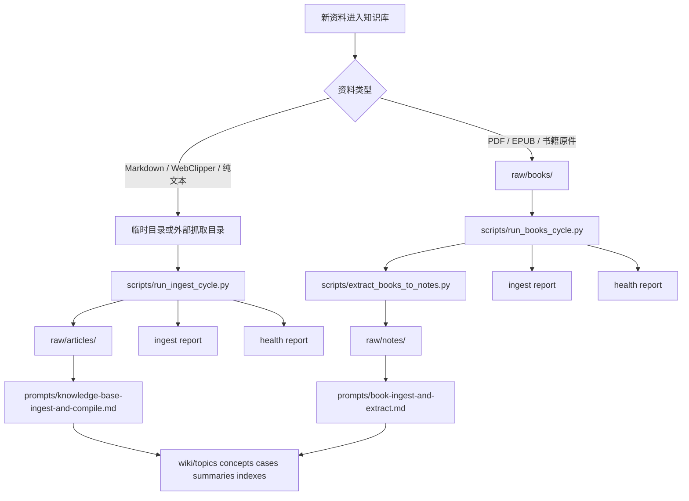

# Workflow Map

## 目的
这页用于说明这个 starter 的两条真实入口，以及**哪些步骤已经半自动化，哪些步骤仍然必须交给 Agent 做语义编译**。

它的目标不是讲抽象流程，而是让使用者快速回答三个问题：
1. 这批资料该走哪条入口
2. 这条入口现在脚本能做到哪一步
3. 到哪一步必须切换到 Agent / 人工判断

## 当前运行形态总览

## 路径 A：Markdown / WebClipper
### 适用输入
- 网页文章
- Web Clipper 导出的 Markdown
- 纯文本笔记

### 当前已自动化到哪
1. 运行 `scripts/run_ingest_cycle.py`
2. 规范入库到 `raw/articles/`
3. 自动生成最小 ingest report
4. 自动生成 health report
5. 自动跑 `kb_health_check.py` 与 `wiki_lint.py`

### 当前仍需 Agent 的部分
- 主题提炼
- 概念归并
- case 抽取
- 交叉链接判断
- wiki 结构化编译

### 当前 duplicate / lifecycle 边界
- report 已有重复判断占位
- 规则页已定义 `duplicate-source / near-duplicate-topic / supplemental-source` 等类型
- runner 当前**不会自动做真正的近似重复语义判断**
- 若命中真实重复来源，应由 Agent / 人工补全 ingest report 相关段落

## 路径 B：Books / PDF / EPUB
### 适用输入
- PDF 书籍
- EPUB 电子书
- 扫描件转出的长文档

### 当前已自动化到哪
1. 运行 `scripts/run_books_cycle.py`
2. 自动调用 `scripts/extract_books_to_notes.py`
3. 生成 `raw/notes/` 中间文本层
4. 自动生成最小 ingest report
5. 自动生成 health report
6. 自动跑 `kb_health_check.py` 与 `wiki_lint.py`

### 当前仍需 Agent 的部分
- 章节主题抽象
- 概念归并
- 文本质量后的主题判断
- wiki 结构化编译

### 当前 duplicate / lifecycle 边界
- report 已记录 `book-duplicate-copy` 与 `--dupN` 弱信号
- `extracted_chars` 偏低会作为 weak-note / parked 候选信号进入 report
- PDF 提取失败时，脚本不会崩掉，而会写出 `quality: pdf-extract-failed` 的 notes 产物
- 但脚本当前**不会自动判断“疑似新版候选”或“有效补充来源”**

## 脚本与 Agent 的责任边界
### 脚本负责
- 文件归位
- 文本提取
- 最小 report
- 健康检查
- lint
- 失败信号显式化

### Agent 负责
- 主题提炼
- 概念归并
- 案例抽取
- 交叉链接
- wiki 编译
- 重复语义判断补全
- 生命周期最终判断

## 当前已具备的最小治理闭环
### Articles 分支
- raw ingest
- ingest report
- health report
- duplicate policy / rubric / pipeline board 可配套使用

### Books 分支
- extract to notes
- ingest report
- health report
- 弱提取信号可进入 parked 判断

## 当前还没有做成全自动的部分
- 近似重复文章自动识别
- 书籍新旧版本自动判别
- wiki 自动语义编译
- notes 质量的强规则评分
- report 与 topic/index 的自动联动更新

这些不是遗漏，而是当前刻意保留给 Agent 的语义层边界。

## 最小操作准则
- 不确定资料类型时，先判断它是不是原生 Markdown
- 只要是书籍原件，就优先走 `raw/books -> raw/notes`
- 不要为了省一步，把 books 流程伪装成 markdown 流程
- report / health 已自动产出，不代表 wiki 已自动完成
- `STATUS: OK` 只说明结构和检查通过，不说明语义编译已经完成

## 快速入口
- 总览：[[overview.md]]
- 当前焦点：[[current-focus.md]]
- 状态面板：[[topic-pipeline-board.md]]
- 升级判断：[[material-promotion-rubric.md]]
- 重复治理：[[duplicate-intake-policy.md]]
- 总索引：[[../indexes/topic-index.md]]
